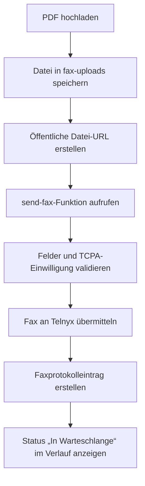

## IRS-Steuererklärungen per Fax senden

Mit Nomadfiling kannst du PDF-Steuererklärungen per Fax senden, den Zustellfortschritt verfolgen und frühere Faxversuche in deinem Konto prüfen. Nutze dies, wenn der IRS eine Faxzustellung verlangt oder akzeptiert, einschließlich Abläufen für Form-7004-Verlängerungen und manueller PDF-Übermittlungen.

<Callout kind="info">

Der Faxversand verwendet die feste Ausgangsnummer `+17869848552` und die feste Faxverbindungs-ID `2935264480004671439`. Du wählst nur die Zielfaxnummer und die zu sendende PDF-Datei.

</Callout>

## Wo du ein Fax senden kannst

Nomadfiling enthält zwei faxbezogene Seiten sowie ein eingebettetes Faxmodal in Einreichungsabläufen. Welche Option du verwendest, hängt davon ab, ob du ein Fax manuell oder innerhalb eines Steuerablaufs sendest.

### FaxSend unter `/fax`

`/fax` ist das unverarbeitete Faxversandformular. Es ist stärker auf Administratoren ausgerichtet und verwendet eine deutsche Oberfläche, stellt die zentralen Faxsteuerungen aber direkt bereit.

Auf dieser Seite kannst du eine PDF hochladen, eine Zielfaxnummer im E.164-Format eingeben, die TCPA-Einwilligung bestätigen und das Fax sofort senden. Unter dem Formular wird außerdem der Faxverlauf angezeigt.

### FaxPostausgang unter `/fax-outbox`

`/fax-outbox` ist der benutzerorientierte Fax-Postausgang. Er enthält die vollständige Anwendungsnavigation und lokalisierte Bezeichnungen und eignet sich daher besser, um gesendete Faxe langfristig zu überwachen.

Diese Seite verwendet dieselben gemeinsamen Faxverlaufsdaten wie der unverarbeitete Faxversand. Wenn du prüfen möchtest, ob ein Fax in die Warteschlange gestellt, zugestellt oder fehlgeschlagen ist, solltest du normalerweise zuerst diese Seite öffnen.

### FaxSendModal in Einreichungsabläufen

Nomadfiling öffnet außerdem ein Faxmodal innerhalb des Verlängerungsablaufs für Form 7004 und des Einreichungsassistenten. Das Modal ist für häufige IRS-Ziele vorkonfiguriert, wodurch weniger manuelle Eingaben nötig sind, wenn du bereits Einreichungs-PDFs in der App erstellst.

Das Modal verwendet denselben Backend-Zustellablauf wie die speziellen Faxseiten. Auch beim Versand über das Modal werden ein Faxprotokolleintrag und Statusaktualisierungen in deinem Verlauf erstellt.

## Ein Fax senden

Nutze den manuellen Versand, wenn du bereits eine PDF und die Zielfaxnummer hast.

<Steps>
  <Step title="Faxversand öffnen" icon="terminal">

  Gehe zu `/fax`, um auf das unverarbeitete Faxformular zuzugreifen, oder nutze das Faxmodal, wenn es im Form-7004- oder Einreichungsablauf erscheint.

  Wenn du nach dem Senden eine benutzerorientiertere Ansicht möchtest, öffne `/fax-outbox` in einem weiteren Tab, um dort die Statusaktualisierung zu beobachten.

  </Step>
  <Step title="Deine PDF hochladen" icon="upload">

  Wähle die PDF-Datei aus, die du faxen möchtest. Nomadfiling lädt die Datei vor dem Versand an den Faxanbieter in den Storage-Bucket `fax-uploads` hoch.

  Nach erfolgreichem Upload erstellt die App eine öffentliche Datei-URL, die der Zustelldienst abrufen kann.

  </Step>
  <Step title="Zielfaxnummer auswählen" icon="edit">

  Gib die Empfängerfaxnummer im E.164-Format ein, zum Beispiel `+18552333091`. Auf der unverarbeiteten Faxseite kannst du, sofern verfügbar, auch Schnellfüll-Schaltflächen für IRS-Nummern verwenden.

  Die Absendernummer bleibt schreibgeschützt und lautet immer `+17869848552`.

  </Step>
  <Step title="TCPA-Einwilligung bestätigen" icon="check-circle">

  Aktiviere vor dem Senden das Kontrollkästchen für die TCPA-Einwilligung. Nomadfiling sendet das Fax nicht, wenn die Einwilligung nicht bestätigt wurde.

  Dies ist ein verbindlicher Validierungsschritt im Faxversanddienst und nicht nur ein Hinweis der Benutzeroberfläche.

  </Step>
  <Step title="Senden und Ergebnis prüfen" icon="play-circle">

  Sende das Formular ab, um die Zustellung zu starten. Eine erfolgreiche Versandanfrage gibt einen Faxdatensatz zurück und erstellt einen Protokolleintrag im Faxverlauf.

  Dein erstes Erfolgssignal ist ein Fax in der Warteschlange im Verlauf. Der endgültige Zustellstatus trifft später über asynchrone Webhook-Aktualisierungen ein.

  </Step>
</Steps>

<Callout kind="alert">

Nomadfiling erfordert vor jedem Faxversand die TCPA-Einwilligung. Wird sie nicht bestätigt, wird die Versandanfrage abgelehnt, bevor der Faxanbieter aufgerufen wird.

</Callout>

## Vorkonfigurierte IRS-Faxnummern

Nomadfiling enthält im Form-7004-Faxmodal häufige IRS-Faxziele. Mit diesen Nummern musst du häufig verwendete Empfänger nicht erneut eingeben.

| Anwendungsfall | Faxnummer |
|---|---|
| Nur Verlängerungen mit Form 7004 | `+18552333091` |
| IRS allgemein | `+18558877737` |
| Nomadfiling-Test | `+17869848552` |

### Wofür die Nummern bestimmt sind

Verwende die Verlängerungsnummer für Form 7004 nur, wenn du dieses Verlängerungsformular faxst. Nutze für andere IRS-Faxübermittlungen die allgemeine IRS-Nummer, wenn sie deinen Einreichungsanweisungen entspricht.

Die Nomadfiling-Nummer eignet sich zum Testen des Ablaufs, nicht zum Senden einer echten IRS-Einreichung.

## Was im Faxverlauf erscheint

Sowohl `/fax` als auch `/fax-outbox` verwenden dieselbe Komponente `FaxHistory`. Daher sind die angezeigten Statusdaten im unverarbeiteten Versand, im Postausgang und in den eingebetteten Faxabläufen konsistent.

Die Verlaufstabelle zeigt die Details, die du benötigst, um zu bestätigen, was gesendet wurde und was danach geschah.

<ParamField body="to_number" param-type="string" show-location="false">
Die Zielfaxnummer, die die PDF empfangen hat.
</ParamField>

<ParamField body="status" param-type="string" show-location="false">
Der aktuelle Faxstatus. Nomadfiling erfasst `queued`, `sending`, `delivered` und `failed`.
</ParamField>

<ParamField body="pages_sent" param-type="integer" show-location="false">
Die Anzahl der Seiten, die der Faxanbieter nach der Verarbeitung des Dokuments meldet.
</ParamField>

<ParamField body="created_at" param-type="datetime" show-location="false">
Der Zeitpunkt, zu dem Nomadfiling den Faxprotokolleintrag erstellt und die Faxanfrage übermittelt hat.
</ParamField>

<ParamField body="completed_at" param-type="datetime" show-location="false">
Der Zeitpunkt, zu dem das Fax einen Endzustand erreicht hat. Dieses Feld wird üblicherweise gesetzt, wenn das Fax `delivered` oder `failed` ist.
</ParamField>

<ParamField body="failure_reason" param-type="string" show-location="false">
Der vom Anbieter gemeldete Fehlergrund, sofern verfügbar. Bei erfolgreichen Zustellungen und laufenden Faxen ist dieses Feld leer.
</ParamField>

## So funktioniert die Faxzustellung

Die Faxzustellung erfolgt in zwei Phasen: Übermittlung und Statusaktualisierungen. Wenn du diese Trennung verstehst, lässt sich der Verlaufsbildschirm leichter interpretieren.

### Phase 1: Nomadfiling übermittelt das Fax

Wenn du auf „Senden“ klickst, lädt Nomadfiling die PDF hoch, erstellt eine öffentliche URL für diese Datei und ruft die Edge Function `send-fax` auf. Diese Funktion validiert erforderliche Umgebungsvariablen und Felder und setzt die TCPA-Einwilligungsanforderung durch.

Wenn die Validierung erfolgreich ist, sendet der Dienst eine Anfrage an `https://api.telnyx.com/v2/faxes` mit Zielnummer, fester Absendernummer, fester Verbindungs-ID, PDF-URL und `quality` auf `high`. Bei Erfolg fügt Nomadfiling einen Datensatz mit Fax-ID, Zustellmetadaten, Einwilligungsflag, IP-Adresse und User-Agent in die Tabelle `fax_logs` ein.

### Phase 2: Telnyx sendet Statusaktualisierungen

Nach der Übermittlung ruft Telnyx den Endpunkt `telnyx-fax-webhook` auf, während das Fax fortschreitet. Nomadfiling aktualisiert den vorhandenen Datensatz in `fax_logs` anhand der Fax-ID, statt einen neuen Datensatz zu erstellen.

Der Webhook aktualisiert gegebenenfalls Status, Seitenanzahl, Dauer, Abschlusszeit und Fehlergrund. `queued` und `sending` sind laufende Zustände, `delivered` und `failed` Endzustände.

## Bedeutung der einzelnen Faxstatus

Entscheide anhand des Statusfelds, ob du warten, es erneut versuchen oder die Zielnummer untersuchen solltest.

| Status | Bedeutung | Was du tun solltest |
|---|---|---|
| `queued` | Nomadfiling hat die Faxanfrage angenommen und an den Anbieter übermittelt | Auf die nächste Aktualisierung warten |
| `sending` | Der Anbieter überträgt das Fax aktiv | Auf den Abschluss warten |
| `delivered` | Das Fax wurde erfolgreich abgeschlossen | Keine Aktion erforderlich |
| `failed` | Das Fax wurde nicht abgeschlossen | `failure_reason` prüfen und gegebenenfalls erneut versuchen |

<Callout kind="tip">

Wenn ein Fax länger als erwartet in `queued` oder `sending` bleibt, aktualisiere zuerst den Postausgang. Statusänderungen werden durch Webhooks gesteuert, sodass das Endergebnis eintreffen kann, nachdem die ursprüngliche Sendeaktion bereits erfolgreich war.

</Callout>

## Was Nomadfiling für jedes Fax speichert

Nomadfiling führt für jede Faxübermittlung ein Zustellprotokoll, damit du prüfen kannst, was wann gesendet wurde. Es enthält sowohl die ursprünglichen Anfragedetails als auch spätere Anbieteraktualisierungen.

### Übermittlungsdaten

Diese Felder werden bei der ersten Übermittlung des Faxes geschrieben:

- `user_id`
- `fax_id`
- `to_number`
- `from_number`
- `connection_id`
- `file_url`
- `status`
- `telnyx_response`
- `consent_confirmed`
- `ip_address`
- `user_agent`

### Aktualisierungsdaten

Diese Felder werden beim Eintreffen von Webhook-Ereignissen aktualisiert:

- `status`
- `telnyx_response`
- `pages_sent`
- `duration_ms`
- `failure_reason`
- `completed_at`

## Wann du das Faxmodal statt der Faxseiten verwenden solltest

Das Faxmodal ist die bessere Wahl, wenn du bereits ein Einreichungspaket in Nomadfiling erstellst. Es reduziert Kontextwechsel und trägt häufige IRS-Ziele für dich ein.

Die speziellen Faxseiten sind besser, wenn du eine vorhandene PDF manuell senden, frühere Übertragungen prüfen oder direkt aus dem Postausgang arbeiten möchtest.

## Häufig gestellte Fragen

<ExpandableGroup>
  <Expandable title="Muss ich die Absenderfaxnummer selbst eingeben?" default-open="true">

  Nein. Nomadfiling sendet alle Faxe von `+17869848552`; das Feld ist im Faxversand schreibgeschützt.

  </Expandable>
  <Expandable title="Kann ich die Faxverbindungs-ID ändern?">

  Nein. Nomadfiling verwendet für ausgehende Faxzustellungen die feste Faxverbindungs-ID `2935264480004671439`.

  </Expandable>
  <Expandable title="Warum war meine Faxversandanfrage erfolgreich, aber das Fax wurde noch nicht zugestellt?">

  Eine erfolgreiche Versandanfrage bedeutet nur, dass das Fax zur Verarbeitung angenommen und protokolliert wurde. Die endgültige Zustellung erfolgt später über Webhook-basierte Statusaktualisierungen, sodass vor einem Endergebnis `queued` oder `sending` angezeigt werden kann.

  </Expandable>
  <Expandable title="Was passiert, wenn ich die TCPA-Einwilligung nicht bestätige?">

  Nomadfiling lehnt die Anfrage vor dem Faxversand ab. Die TCPA-Einwilligung ist für den Dienst `send-fax` erforderlich.

  </Expandable>
  <Expandable title="Wo kann ich fehlgeschlagene Faxe sehen?">

  Öffne `/fax-outbox` oder prüfe den Verlaufsbereich unter dem Formular auf `/fax`. Beide Oberflächen verwenden dieselbe gemeinsame Faxverlaufskomponente und zeigen, sofern verfügbar, Fehlerstatus und Fehlergrund.

  </Expandable>
  <Expandable title="Überprüft Nomadfiling Webhook-Signaturen des Faxanbieters?">

  Der aktuelle Webhook aktualisiert Faxprotokolle ohne Signaturprüfung. Wenn du die Funktion nur als Endbenutzer verwendest, besteht die praktische Auswirkung darin, dass Status weiterhin automatisch in deinem Postausgang erscheinen.

  </Expandable>
</ExpandableGroup>

## Verwandte Seiten

<Columns cols={2}>
  <Card title="Form 5472 und 1120" href="/de/form-5472-1120" icon="file-text" cta="Leitfaden öffnen">
  Erstelle die wichtigsten Einreichungs-PDFs, bevor du sie per Fax sendest.
  </Card>
  <Card title="Form-7004-Verlängerung" href="/de/form-7004-extension" icon="arrow-right" cta="Leitfaden öffnen">
  Nutze den Verlängerungsablauf mit dem vorkonfigurierten Faxmodal.
  </Card>
  <Card title="Funktionen" href="/de/features" icon="grid" cta="Funktionen ansehen">
  Prüfe weitere Einreichungs-, Dokument- und Workflow-Funktionen in Nomadfiling.
  </Card>
  <Card title="Dashboard" href="/de/dashboard" icon="home" cta="Dashboard öffnen">
  Kehre zu deinem Konto-Dashboard zurück, um Einreichungen und Aktivitäten zu verwalten.
  </Card>
</Columns>
