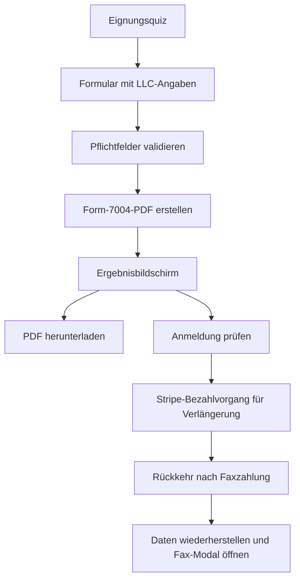

## Erhalten Sie mehr Zeit für die Einreichung der Steuererklärung Ihrer US-LLC

Mit Form 7004 können Sie mehr Zeit für die Einreichung beantragen, wenn Sie Ihre jährliche Steuererklärung nicht fristgerecht einreichen können. In Nomadfiling durchläuft der Verlängerungsprozess drei klare Phasen: Eignung bestätigen, Formular erstellen und Zustellungsart auswählen.

<Callout kind="info">

Dieser Verlängerungsworkflow ist für das Steuerjahr 2025 ausgelegt und erstellt Form 7004 in Ihrem Browser aus der Vorlage `f7004-2025.pdf`.

</Callout>

### Was diese Fristverlängerung leistet

Der Verlängerungsprozess hilft Ihnen:

- zu prüfen, ob Ihre LLC die Voraussetzungen erfüllt, bevor Sie Zeit mit dem Ausfüllen des Formulars verbringen
- ein ausgefülltes Form-7004-PDF clientseitig zu erstellen
- das PDF sofort herunterzuladen
- das Formular optional über einen separaten kostenpflichtigen Bezahlvorgang per Fax zu senden

### Was diese Fristverlängerung nicht leistet

Eine Fristverlängerung gibt Ihnen mehr Zeit für die Einreichung. Sie setzt keine Ausschlussbedingungen aus der Eignungsprüfung außer Kraft und ersetzt keine professionelle Beratung, wenn Ihre Situation eine Steuerschuld oder andere Verlängerungsanträge umfasst.

<Callout kind="alert">

Wenn Sie wissen, dass Sie steuerpflichtig sind, bereits andere Fristverlängerungen eingereicht haben oder für den Zeitraum eine bekannte Steuerschuld besteht, stuft Nomadfiling den Verlängerungsprozess als nicht geeignet ein. In diesen Fällen kann die App statt der Fortsetzung den Hinweis anzeigen, mit einem CPA zu sprechen.

</Callout>

## Folgen Sie dem dreiphasigen Workflow

<Steps>
  <Step title="Eignungsprüfung abschließen" icon="check-circle">

  In der ersten Phase werden sechs Ja-oder-Nein-Fragen gestellt, um festzustellen, ob Sie fortfahren können. Die Logik ist bei den blockierenden Fragen streng, sodass Sie eine Antwort erhalten, bevor Sie Geschäftsdaten eingeben.

  #### Fragen der Eignungsprüfung

  - **Frage 1** — Ist der Einreichende eine US-LLC? Sie müssen mit **Ja** antworten.
  - **Frage 2** — Benötigt der Einreichende eine Fristverlängerung? Sie müssen mit **Ja** antworten.
  - **Frage 3** — Nur Warnung. Diese Frage kann einen Hinweis anzeigen, blockiert den Ablauf jedoch nicht.
  - **Frage 4** — Ist der Einreichende steuerpflichtig? Sie müssen mit **Nein** antworten.
  - **Frage 5** — Hat der Einreichende andere Fristverlängerungen eingereicht? Sie müssen mit **Nein** antworten.
  - **Frage 6** — Hat der Einreichende eine bekannte Steuerschuld? Sie müssen mit **Nein** antworten.

  Die Verlängerung bleibt nur zulässig, wenn die Fragen 1 und 2 wahr und die Fragen 4, 5 und 6 falsch sind.

  #### Was geschieht, wenn eine Antwort nicht zulässig ist

  Nomadfiling zeigt direkt bei jeder Frage eine Rückmeldung an, anstatt bis zum Ende zu warten. Dadurch erkennen Sie leichter, welche Antwort den Workflow blockiert und warum Sie nicht fortfahren können.

  Wenn Ihre Antworten darauf hindeuten, dass die Verlängerung nicht über den Self-Service-Ablauf eingereicht werden sollte, kann die App als nächsten Schritt eine CPA-Empfehlungskarte anzeigen.

  </Step>

  <Step title="LLC-Angaben eingeben und Formular erstellen" icon="edit">

  In der zweiten Phase werden die Geschäftsinformationen erfasst, die zur Erstellung von Form 7004 erforderlich sind. Nach dem Absenden validiert Nomadfiling die Pflichtfelder und erstellt das PDF sofort.

  #### Pflichtfelder

  <ParamField body="LLC-Name" param-type="string" required="true" show-location="false">
  Der rechtliche Name Ihrer LLC, wie er auf dem Verlängerungsformular erscheinen soll.
  </ParamField>

  <ParamField body="EIN" param-type="string" required="true" show-location="false">
  Ihre Employer Identification Number.
  </ParamField>

  <ParamField body="Straße" param-type="string" required="true" show-location="false">
  Die primäre Straßenanschrift der LLC.
  </ParamField>

  <ParamField body="Adresszusatz" param-type="string" required="false" show-location="false">
  Wohnung, Suite, Einheit oder eine andere zweite Adresszeile, falls vorhanden.
  </ParamField>

  <ParamField body="Stadt" param-type="string" required="true" show-location="false">
  Der Stadtteil Ihrer Geschäftsadresse.
  </ParamField>

  <ParamField body="Bundesstaat" param-type="string" required="true" show-location="false">
  Wählen Sie Ihren Bundesstaat aus dem Dropdown-Menü. Die Liste umfasst alle 50 Bundesstaaten und den District of Columbia.
  </ParamField>

  <ParamField body="ZIP" param-type="string" required="true" show-location="false">
  Ihre ZIP-Postleitzahl.
  </ParamField>

  <ParamField body="Erstes Jahr?" param-type="boolean" required="true" show-location="false">
  Wählen Sie aus, ob dies das erste Steuerjahr der LLC ist.
  </ParamField>

  <ParamField body="Gründungsdatum der LLC" param-type="date" required="false" show-location="false">
  Nur erforderlich, wenn **Erstes Jahr?** auf Ja gesetzt ist. Die Datumsauswahl erlaubt Daten von `2025-01-02` bis heute.
  </ParamField>

  <ParamField body="TCPA-Bestätigung" param-type="boolean" required="true" show-location="false">
  Sie müssen das Bestätigungsfeld aktivieren, bevor Sie das Formular absenden.
  </ParamField>

  #### Wie die Steuerjahresdaten festgelegt werden

  Für die meisten Einreichenden verwendet das erstellte Formular als Beginn des Steuerjahres `01/01/2025` und als Ende `12/31/2025`. Wenn Sie die LLC als Einreichende im ersten Jahr kennzeichnen, wird stattdessen das Gründungsdatum der LLC als Beginn des Steuerjahres verwendet.

  #### Woran Sie den Erfolg erkennen

  Nach einer gültigen Übermittlung ruft Nomadfiling `generateForm7004()` auf und erstellt mit `pdf-lib` ein PDF. Der Workflow wechselt anschließend zum Ergebnisbildschirm, auf dem Sie die Einreichungsübersicht prüfen und die Datei herunterladen können.

  </Step>

  <Step title="PDF herunterladen oder per Fax senden" icon="upload">

  In der Ergebnisphase erhalten Sie ein fertiges Verlängerungsformular und zwei Zustellungswege: selbst herunterladen oder die direkte Faxzustellung nutzen.

  #### Einreichungsübersicht prüfen

  Der Ergebnisbildschirm zeigt eine kompakte Zusammenfassung mit diesen Angaben:

  - **LLC-Name**
  - **Steuerjahr**, festgelegt auf 2025
  - **EIN**
  - **Neue Frist**

  Diese Zusammenfassung dient als schnelle Kontrolle, bevor Sie das Formular speichern oder senden.

  #### PDF herunterladen

  Wählen Sie die Download-Schaltfläche, um die erstellte Datei lokal zu speichern. Der Dateiname folgt diesem Muster: `Form-7004-{llcName}.pdf`.

  #### Direkte Zustellung per Fax verwenden

  Für die direkte Faxzustellung ist eine Anmeldung erforderlich. Wenn Sie nicht angemeldet sind, öffnet Nomadfiling vor dem Fortfahren einen Anmeldedialog.

  Wenn Sie angemeldet sind, speichert die App Ihre Verlängerungsdaten im lokalen Speicher, startet über die Edge Function `create-extension-checkout` einen separaten Stripe-Bezahlvorgang und leitet Sie zu Stripe weiter. Wenn Sie mit `?fax_paid=true` zurückkehren, stellt die App Ihre gespeicherten Daten wieder her, erstellt das PDF erneut und öffnet das Modal zum Faxversand.

  #### Bereits konfigurierte IRS-Faxnummern

  Das Fax-Modal enthält drei voreingestellte Faxziele:

  - **`+18552333091`** — IRS USA nur für Fristverlängerungen mit Form 7004
  - **`+18558877737`** — IRS USA allgemein
  - **`+17869848552`** — Nomad Filing Test

  #### Wenn Sie das Formular lieber per Post senden

  Der Ergebnisbildschirm enthält außerdem eine Karte für den Postversand als Ausweichoption. Verwenden Sie diese Option, wenn Sie die Faxzustellung nicht nutzen möchten oder Ihre Einreichungssituation eine Übermittlung außerhalb der App erfordert.

  </Step>
</Steps>

## Verstehen Sie die Eignungsregeln, bevor Sie beginnen

Der Eignungsbildschirm soll den Vorgang frühzeitig stoppen, wenn Ihre Antworten darauf hindeuten, dass der automatisierte Verlängerungsprozess nicht geeignet ist. So wird verhindert, dass Sie ein Formular erstellen, das nicht zu Ihrer Situation passt.

### Zulässige Antworten auf einen Blick

| Frage | Zulässige Antwort | Blockiert die Einreichung bei anderer Antwort |
|---|---|---|
| Ist der Einreichende eine US-LLC? | Ja | Ja |
| Benötigt der Einreichende eine Fristverlängerung? | Ja | Ja |
| Frage nur mit Warnhinweis | Beliebig | Nein |
| Ist der Einreichende steuerpflichtig? | Nein | Ja |
| Hat der Einreichende andere Fristverlängerungen eingereicht? | Nein | Ja |
| Hat der Einreichende eine bekannte Steuerschuld? | Nein | Ja |

### Warum einige Antworten den Workflow stoppen

Die Fragen 4, 5 und 6 sind in der App-Logik Ausschlusskriterien. Wenn eine dieser Fragen mit Ja beantwortet wird, stuft Nomadfiling die Verlängerung als nicht zulässig ein und zeigt bei dieser Frage sofort eine Rückmeldung an.

Frage 3 ist anders. Sie kann eine Warnung oder zusätzliche Hinweise auslösen, bestimmt die Eignung jedoch nicht allein.

## Was im Hintergrund geschieht

Nomadfiling hält den Verlängerungsprozess schlank, indem das PDF im Browser erstellt wird, anstatt auf eine serverseitige Dokumenterstellung zu warten. Dadurch erfolgt der Übergang von der Formulareingabe zum Download nahezu unmittelbar.

### Separater Bezahlvorgang für die Faxzustellung

Das Verlängerungsformular selbst wird vor der Zahlung erstellt, die direkte Faxzustellung verwendet jedoch einen eigenen Bezahlvorgang. Dieser ist von anderen Einreichungsabläufen getrennt und wird von der Edge Function `create-extension-checkout` gestartet.

### Clientseitige PDF-Erstellung

Die erstellte Datei verwendet die Vorlage `f7004-2025.pdf` und wird clientseitig mit `pdf-lib` erzeugt. Ihre Formulardaten werden verwendet, um das Verlängerungs-PDF für 2025 auszufüllen, bevor Sie es herunterladen oder per Fax senden.

## FAQ

<ExpandableGroup>
  <Expandable title="Benötige ich ein Konto, um Form 7004 zu erstellen?" default-open="false">

  Nein. Sie können die Eignungsprüfung abschließen, das Formular ausfüllen und das PDF erstellen, ohne sich anzumelden.

  Sie müssen sich nur anmelden, wenn Sie die direkte Faxzustellung nutzen möchten.

  </Expandable>

  <Expandable title="Was geschieht, wenn ich nicht geeignet bin?" default-open="false">

  Nomadfiling zeigt bei der Frage, die das Problem verursacht hat, direkt eine Rückmeldung an und verhindert, dass Sie den automatisierten Verlängerungsprozess fortsetzen.

  Je nach Antwort kann die App außerdem eine CPA-Empfehlungskarte anzeigen, damit Sie einen klaren nächsten Schritt haben.

  </Expandable>

  <Expandable title="Welches Steuerjahr deckt diese Verlängerung ab?" default-open="false">

  Dieser Workflow ist für das Steuerjahr 2025 konfiguriert.

  Das erstellte Formular verwendet `12/31/2025` als Enddatum des Steuerjahres und `01/01/2025` als Anfangsdatum, sofern Sie die LLC nicht als Einreichende im ersten Jahr kennzeichnen.

  </Expandable>

  <Expandable title="Was ist, wenn dies das erste Jahr meiner LLC ist?" default-open="false">

  Aktivieren Sie den Schalter für das erste Jahr und geben Sie das Gründungsdatum der LLC ein.

  Nomadfiling verwendet dann das Gründungsdatum anstelle von `01/01/2025` als Beginn des Steuerjahres.

  </Expandable>

  <Expandable title="Kann ich das Formular per Post statt per Fax senden?" default-open="false">

  Ja. Der Ergebnisbildschirm enthält eine Ausweichoption für den Postversand.

  Verwenden Sie diesen Weg, wenn Sie nicht für die direkte Faxzustellung bezahlen möchten oder die Einreichung lieber selbst abwickeln.

  </Expandable>

  <Expandable title="Was geschieht, nachdem ich für die Faxzustellung bezahlt habe?" default-open="false">

  Nachdem Stripe Sie mit dem Rückgabeparameter `fax_paid` zurückgeleitet hat, stellt Nomadfiling Ihre gespeicherten Verlängerungsdaten wieder her, erstellt das PDF erneut und öffnet das Modal zum Faxversand.

  Von dort können Sie das erstellte Form 7004 an eine der konfigurierten Faxnummern senden.

  </Expandable>
</ExpandableGroup>

## Fahren Sie mit Ihrer Einreichung fort

Wenn Sie die Verlängerung nutzen, weil Sie vor der Erstellung Ihrer jährlichen Steuererklärung mehr Zeit benötigen, ist der nächste Schritt nach der Verlängerung in der Regel Ihre Einreichung von Form 5472 und Pro-forma Form 1120.

<Columns cols={2}>
  <Card title="Einreichung von Form 5472 starten" href="/de/form-5472-1120" icon="file-text" cta="Formular öffnen" />
  <Card title="Faxservice" href="/de/fax-service" icon="upload" cta="Zustellungsoptionen anzeigen" />
  <Card title="Preise" href="/de/getting-started/pricing" icon="bar-chart" cta="Preise anzeigen" />
  <Card title="Alle Funktionen" href="/de/features" icon="grid" cta="Funktionen durchsuchen" />
</Columns>
