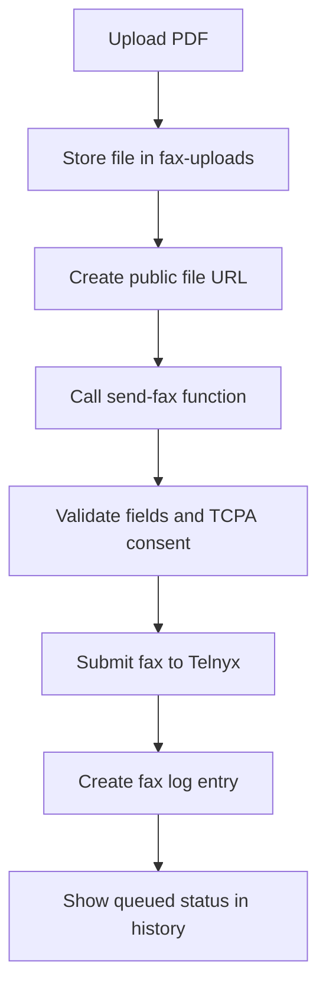

## Send IRS tax filings by fax

Nomadfiling lets you send PDF tax filings by fax, track delivery progress, and review past fax attempts from your account. Use it when the IRS requires or accepts fax delivery, including Form 7004 extension flows and manual PDF submissions.

<Callout kind="info">

The fax sender uses a fixed outbound number, `+17869848552`, and a fixed fax connection ID, `2935264480004671439`. You only choose the destination fax number and the PDF file to send.

</Callout>

## Where you can send a fax

Nomadfiling includes two fax-related pages plus an embedded fax modal in filing flows. Which option you use depends on whether you are sending a fax manually or from inside a tax workflow.

### FaxSend at `/fax`

`/fax` is the raw fax sending form. It is more admin-oriented and uses a German interface, but it exposes the core fax controls directly.

You can use this page to upload a PDF, enter a destination fax number in E.164 format, confirm TCPA consent, and send the fax immediately. The page also shows fax history below the form.

### FaxPostausgang at `/fax-outbox`

`/fax-outbox` is the user-facing fax outbox. It includes the full application navigation and localized labels, so it is the better place to monitor sent faxes over time.

This page uses the same shared fax history data as the raw fax sender. If you want to check whether a fax was queued, delivered, or failed, this is usually the page to open first.

### FaxSendModal in filing flows

Nomadfiling also opens a fax modal inside the Form 7004 extension flow and the filing wizard. The modal is preconfigured for common IRS destinations, which reduces manual entry when you are already generating filing PDFs inside the app.

That modal uses the same backend delivery flow as the dedicated fax pages. Sending from the modal still creates a fax log entry and status updates in your history.

## Send a fax

Use the manual sender when you already have a PDF and the destination fax number.

<Steps>
  <Step title="Open the fax sender" icon="terminal">

  Go to `/fax` to access the raw fax form, or use the fax modal when it appears in the Form 7004 or filing workflow.

  If you want a more user-facing view after sending, open `/fax-outbox` in another tab so you can watch the status update there.

  </Step>
  <Step title="Upload your PDF" icon="upload">

  Select the PDF file you want to fax. Nomadfiling uploads the file to the `fax-uploads` storage bucket before sending it to the fax provider.

  After the upload succeeds, the app generates a public file URL that the delivery service can fetch.

  </Step>
  <Step title="Choose the destination fax number" icon="edit">

  Enter the recipient fax number in E.164 format, such as `+18552333091`. On the raw fax page, you can also use quick-fill buttons for IRS numbers where available.

  The sender number stays read-only and is always `+17869848552`.

  </Step>
  <Step title="Confirm TCPA consent" icon="check-circle">

  Check the TCPA consent box before sending. Nomadfiling will not send the fax unless consent is confirmed.

  This is a hard validation step in the fax sending service, not a UI-only prompt.

  </Step>
  <Step title="Send and verify the result" icon="play-circle">

  Submit the form to start delivery. A successful send request returns a fax record and creates a log entry in fax history.

  Your first success signal is a queued fax entry in history. Final delivery status arrives later through asynchronous webhook updates.

  </Step>
</Steps>

<Callout kind="alert">

Nomadfiling requires TCPA consent before sending any fax. If consent is not confirmed, the send request is rejected before the fax provider is called.

</Callout>

## Preconfigured IRS fax numbers

Nomadfiling includes common IRS fax destinations in the Form 7004 fax modal. These numbers help you avoid retyping frequent recipients.

| Use case | Fax number |
|---|---|
| Form 7004 extensions only | `+18552333091` |
| IRS general | `+18558877737` |
| Nomadfiling test | `+17869848552` |

### What the numbers are for

Use the Form 7004 extension number only when you are faxing that extension form. For other IRS fax submissions, use the general IRS number if it matches your filing instructions.

The Nomadfiling number is useful for testing the flow, not for sending a real IRS filing.

## What appears in fax history

Both `/fax` and `/fax-outbox` use the same `FaxHistory` component. That means the status data you see is consistent across the raw sender, the outbox, and the embedded fax workflows.

The history table shows the details you need to confirm what was sent and what happened next.

<ParamField body="to_number" param-type="string" show-location="false">
The destination fax number that received the PDF.
</ParamField>

<ParamField body="status" param-type="string" show-location="false">
The current fax status. Nomadfiling records `queued`, `sending`, `delivered`, and `failed`.
</ParamField>

<ParamField body="pages_sent" param-type="integer" show-location="false">
The number of pages reported by the fax provider after processing the document.
</ParamField>

<ParamField body="created_at" param-type="datetime" show-location="false">
When Nomadfiling created the fax log entry and submitted the fax request.
</ParamField>

<ParamField body="completed_at" param-type="datetime" show-location="false">
When the fax reached a terminal state. This field is typically set when the fax is `delivered` or `failed`.
</ParamField>

<ParamField body="failure_reason" param-type="string" show-location="false">
The provider-reported reason for failure, when available. This field is empty for successful deliveries and in-progress faxes.
</ParamField>

## How fax delivery works

Fax delivery happens in two stages: submission and status updates. Understanding that split makes the history screen easier to interpret.

### Stage 1: Nomadfiling submits the fax

When you click send, Nomadfiling uploads the PDF, creates a public URL for that file, and calls the `send-fax` edge function. That function validates required environment variables, checks required fields, and enforces the TCPA consent requirement.

If validation passes, the service sends a request to `https://api.telnyx.com/v2/faxes` with the destination number, the fixed sender number, the fixed connection ID, the PDF URL, and `quality` set to `high`. On success, Nomadfiling inserts a record into the `fax_logs` table with the fax ID, delivery metadata, consent flag, IP address, and user agent.

### Stage 2: Telnyx sends status updates

After submission, Telnyx calls the `telnyx-fax-webhook` endpoint as the fax progresses. Nomadfiling updates the existing `fax_logs` record by fax ID instead of creating a new record.

The webhook updates status, page count, duration, completion time, and failure reason when applicable. `queued` and `sending` are in-progress states, while `delivered` and `failed` are terminal states.

## What each fax status means

Use the status field to decide whether to wait, retry, or investigate the destination number.

| Status | Meaning | What you should do |
|---|---|---|
| `queued` | Nomadfiling accepted the fax request and submitted it to the provider | Wait for the next update |
| `sending` | The provider is actively transmitting the fax | Wait for completion |
| `delivered` | The fax completed successfully | No action needed |
| `failed` | The fax did not complete | Review `failure_reason` and retry if appropriate |

<Callout kind="tip">

If a fax stays in `queued` or `sending` longer than expected, refresh the outbox first. Status changes are webhook-driven, so the final result may arrive after the original send action has already succeeded.

</Callout>

## What Nomadfiling stores for each fax

Nomadfiling keeps a delivery log for each fax submission so you can audit what was sent and when. The log includes both the original request details and later provider updates.

### Submission data

These fields are written when the fax is first submitted:

- `user_id`
- `fax_id`
- `to_number`
- `from_number`
- `connection_id`
- `file_url`
- `status`
- `telnyx_response`
- `consent_confirmed`
- `ip_address`
- `user_agent`

### Update data

These fields are updated as webhook events arrive:

- `status`
- `telnyx_response`
- `pages_sent`
- `duration_ms`
- `failure_reason`
- `completed_at`

## When to use the fax modal instead of the fax pages

The fax modal is the better choice when you are already generating a filing package inside Nomadfiling. It reduces context switching and fills common IRS destinations for you.

The dedicated fax pages are better when you need to send an existing PDF manually, verify past transmissions, or work directly from the outbox.

## Frequently asked questions

<ExpandableGroup>
  <Expandable title="Do I need to enter the sender fax number myself?" default-open="true">

  No. Nomadfiling sends all faxes from `+17869848552`, and the field is read-only in the fax sender.

  </Expandable>
  <Expandable title="Can I change the fax connection ID?">

  No. Nomadfiling uses a fixed fax connection ID, `2935264480004671439`, for outbound fax delivery.

  </Expandable>
  <Expandable title="Why did my fax send request succeed but the fax is not delivered yet?">

  A successful send request only means the fax was accepted for processing and logged. Final delivery happens later through webhook-based status updates, so you may see `queued` or `sending` before a terminal result appears.

  </Expandable>
  <Expandable title="What happens if I do not check TCPA consent?">

  Nomadfiling rejects the request before sending the fax. TCPA consent is required by the `send-fax` service.

  </Expandable>
  <Expandable title="Where can I see failed faxes?">

  Open `/fax-outbox` or check the history section below the form on `/fax`. Both surfaces use the same shared fax history component and show failure status and failure reason when available.

  </Expandable>
  <Expandable title="Does Nomadfiling verify webhook signatures from the fax provider?">

  The current webhook updates fax logs without signature verification. If you are only using the feature as an end user, the practical effect is that statuses still appear automatically in your outbox.

  </Expandable>
</ExpandableGroup>

## Related pages

<Columns cols={2}>
  <Card title="Form 5472 and 1120" href="/form-5472-1120" icon="file-text" cta="Open guide">
  Generate the main filing PDFs before sending them by fax.
  </Card>
  <Card title="Form 7004 extension" href="/form-7004-extension" icon="arrow-right" cta="Open guide">
  Use the extension workflow that includes the preconfigured fax modal.
  </Card>
  <Card title="Features" href="/features" icon="grid" cta="View features">
  Review other filing, document, and workflow capabilities in Nomadfiling.
  </Card>
  <Card title="Dashboard" href="/dashboard" icon="home" cta="Open dashboard">
  Return to your account dashboard to manage filings and activity.
  </Card>
</Columns>