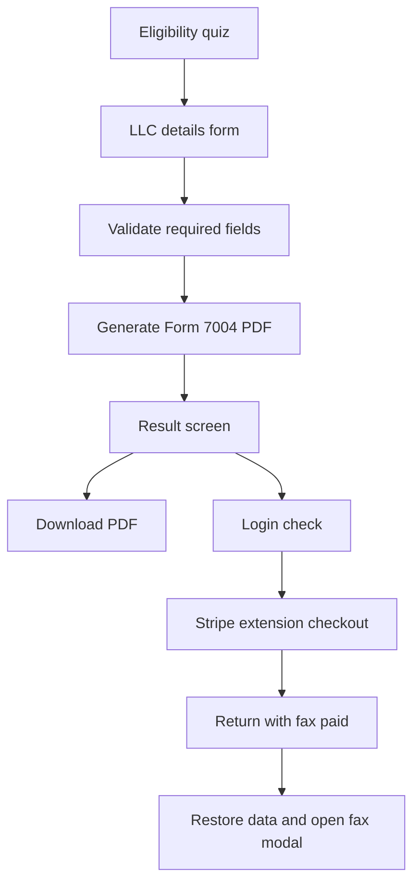

## Get more time to file your US LLC return

Form 7004 lets you request more time to file when you are not ready to submit your annual return by the deadline. In Nomadfiling, the extension flow moves through three clear phases: confirm eligibility, generate the form, and choose how to deliver it.

<Callout kind="info">

This extension workflow is built for the 2025 tax year and generates Form 7004 from the `f7004-2025.pdf` template in your browser.

</Callout>

### What this extension does

The extension flow helps you:

- check whether your LLC qualifies before you spend time filling out the form
- generate a completed Form 7004 PDF client-side
- download the PDF immediately
- optionally send the form by fax through a separate paid checkout flow

### What this extension does not do

An extension gives you more time to file. It does not override disqualifying conditions in the eligibility check, and it is not a substitute for professional advice if your situation involves tax liability or other extension filings.

<Callout kind="alert">

If you know you are liable for tax, have already filed other extensions, or have known tax liability for the period, Nomadfiling marks the extension flow as ineligible. In those cases, the app may show guidance to speak with a CPA instead of continuing.

</Callout>

## Follow the 3-phase workflow

<Steps>
  <Step title="Complete the eligibility check" icon="check-circle">

  The first phase asks six Yes or No questions and determines whether you can continue. The logic is strict on the blocking questions, so you get an answer before entering business details.

  #### Questions in the eligibility check

  - **Question 1** — Is the filer a US LLC? You must answer **Yes**.
  - **Question 2** — Does the filer need an extension? You must answer **Yes**.
  - **Question 3** — Warning only. This question can show guidance but does not block the flow.
  - **Question 4** — Is the filer liable for tax? You must answer **No**.
  - **Question 5** — Has the filer filed other extensions? You must answer **No**.
  - **Question 6** — Does the filer have known tax liability? You must answer **No**.

  The extension remains eligible only when Questions 1 and 2 are true, and Questions 4, 5, and 6 are false.

  #### What happens when an answer is not eligible

  Nomadfiling shows inline feedback for each question instead of waiting until the end. That makes it easier to see which answer is blocking the workflow and why you cannot proceed.

  If your answers suggest the extension should not be filed through the self-serve flow, the app can show a CPA referral card as a next step.

  </Step>

  <Step title="Enter your LLC details and generate the form" icon="edit">

  The second phase collects the business information needed to create Form 7004. After you submit the form, Nomadfiling validates the required fields and generates the PDF immediately.

  #### Required fields

  <ParamField body="LLC Name" param-type="string" required="true" show-location="false">
  Your legal LLC name as it should appear on the extension form.
  </ParamField>

  <ParamField body="EIN" param-type="string" required="true" show-location="false">
  Your Employer Identification Number.
  </ParamField>

  <ParamField body="Street" param-type="string" required="true" show-location="false">
  The primary street address for the LLC.
  </ParamField>

  <ParamField body="Suite" param-type="string" required="false" show-location="false">
  Apartment, suite, unit, or other secondary address line if you use one.
  </ParamField>

  <ParamField body="City" param-type="string" required="true" show-location="false">
  The city portion of your business address.
  </ParamField>

  <ParamField body="State" param-type="string" required="true" show-location="false">
  Select your state from the dropdown. The list includes all 50 states and the District of Columbia.
  </ParamField>

  <ParamField body="ZIP" param-type="string" required="true" show-location="false">
  Your ZIP code.
  </ParamField>

  <ParamField body="Is First Year?" param-type="boolean" required="true" show-location="false">
  Choose whether this is the LLC's first tax year.
  </ParamField>

  <ParamField body="LLC Creation Date" param-type="date" required="false" show-location="false">
  Required only when **Is First Year?** is set to Yes. The date picker allows dates from `2025-01-02` through today.
  </ParamField>

  <ParamField body="TCPA confirmation" param-type="boolean" required="true" show-location="false">
  You must check the confirmation box before submitting the form.
  </ParamField>

  #### How tax year dates are set

  For most filers, the generated form uses a tax year beginning date of `01/01/2025` and an ending date of `12/31/2025`. If you mark the LLC as a first-year filer, the tax year beginning date uses the LLC creation date instead.

  #### What success looks like

  After a valid submission, Nomadfiling calls `generateForm7004()` and produces a PDF using `pdf-lib`. The workflow then moves to the result screen where you can review the filing summary and download the file.

  </Step>

  <Step title="Download the PDF or send it by fax" icon="upload">

  The result phase gives you a finished extension form and two delivery paths: download it yourself or use direct fax delivery.

  #### Review the filing summary

  The result screen shows a compact summary with these details:

  - **LLC name**
  - **Tax year** set to 2025
  - **EIN**
  - **New deadline**

  This summary is a quick check before you save or send the form.

  #### Download the PDF

  Select the download button to save the generated file locally. The file name follows this pattern: `Form-7004-{llcName}.pdf`.

  #### Use direct delivery by fax

  Direct fax delivery requires a login. If you are not logged in, Nomadfiling opens a login dialog before continuing.

  If you are logged in, the app saves your extension data in local storage, starts a separate Stripe checkout through the `create-extension-checkout` edge function, and redirects you to Stripe. When you return with `?fax_paid=true`, the app restores your saved data, regenerates the PDF, and opens the fax send modal.

  #### IRS fax numbers already configured

  The fax modal includes three preset fax destinations:

  - **`+18552333091`** — IRS USA Form 7004 Extensions Only
  - **`+18558877737`** — IRS USA general
  - **`+17869848552`** — Nomad Filing Test

  #### If you prefer to mail the form

  The result screen also includes a mailing fallback card. Use that option if you do not want to use fax delivery or if your filing situation requires you to handle submission outside the app.

  </Step>
</Steps>

## Understand the eligibility rules before you start

The eligibility screen is designed to stop the process early when your answers indicate the automated extension flow is not appropriate. That keeps you from generating a form that does not match your situation.

### Eligible answers at a glance

| Question | Eligible answer | Blocks filing if answered differently |
|---|---|---|
| Is the filer a US LLC? | Yes | Yes |
| Does the filer need an extension? | Yes | Yes |
| Warning-only question | Either | No |
| Is the filer liable for tax? | No | Yes |
| Has the filer filed other extensions? | No | Yes |
| Does the filer have known tax liability? | No | Yes |

### Why some answers stop the workflow

Questions 4, 5, and 6 are disqualifiers in the app's logic. If any of those answers are Yes, Nomadfiling treats the extension as ineligible and shows immediate feedback on that question.

Question 3 is different. It can trigger a warning or extra guidance, but it does not determine eligibility by itself.

## Know what happens behind the scenes

Nomadfiling keeps the extension flow lightweight by generating the PDF in the browser instead of waiting for a server-side document build. That makes the handoff from form entry to download nearly immediate.

### Separate checkout for fax delivery

The extension form itself is generated before payment, but direct fax delivery uses its own checkout flow. This checkout is separate from other filing flows and is started by the `create-extension-checkout` edge function.

### Client-side PDF generation

The generated file uses the `f7004-2025.pdf` template and is built client-side with `pdf-lib`. Your form data is used to populate the 2025 extension PDF before you download it or send it by fax.

## FAQ

<ExpandableGroup>
  <Expandable title="Do I need an account to generate Form 7004?" default-open="false">

  No. You can complete the eligibility check, fill out the form, and generate the PDF without logging in.

  You only need to log in if you want to use the direct fax delivery option.

  </Expandable>

  <Expandable title="What happens if I am not eligible?" default-open="false">

  Nomadfiling shows inline feedback on the question that caused the problem and prevents you from continuing through the automated extension flow.

  Depending on the answer, the app may also show a CPA referral card so you have a clear next step.

  </Expandable>

  <Expandable title="What tax year does this extension cover?" default-open="false">

  This workflow is configured for the 2025 tax year.

  The generated form uses `12/31/2025` as the tax year end date, and it uses `01/01/2025` as the tax year begin date unless you mark the LLC as a first-year filer.

  </Expandable>

  <Expandable title="What if this is my LLC's first year?" default-open="false">

  Turn on the first-year toggle and enter the LLC creation date.

  When you do that, Nomadfiling uses the creation date as the tax year beginning date instead of `01/01/2025`.

  </Expandable>

  <Expandable title="Can I mail the form instead of faxing it?" default-open="false">

  Yes. The result screen includes a mailing fallback option.

  Use that path if you do not want to pay for direct fax delivery or if you prefer to handle submission yourself.

  </Expandable>

  <Expandable title="What happens after I pay for fax delivery?" default-open="false">

  After Stripe sends you back with the `fax_paid` return parameter, Nomadfiling restores your saved extension data, regenerates the PDF, and opens the fax send modal.

  From there, you can send the generated Form 7004 to one of the configured fax numbers.

  </Expandable>
</ExpandableGroup>

## Continue with your filing

If you are using the extension because you need more time before preparing your annual return, the next step after the extension is usually your Form 5472 and pro forma Form 1120 filing.

<Columns cols={2}>
  <Card title="Start Form 5472 filing" href="/form-5472-1120" icon="file-text" cta="Open form" />
  <Card title="Fax service" href="/fax-service" icon="upload" cta="View delivery options" />
  <Card title="Pricing" href="/getting-started/pricing" icon="bar-chart" cta="See pricing" />
  <Card title="All features" href="/features" icon="grid" cta="Browse features" />
</Columns>