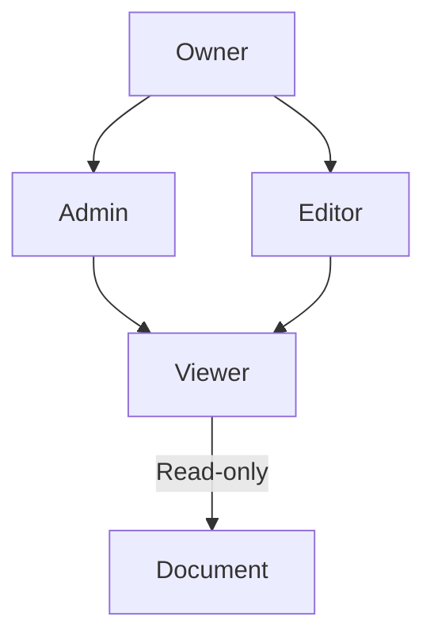

## Overview

Nomadfiling provides essential tools for organizing, editing, and collaborating on project documentation. You can structure your docs like a file system with folders, edit in rich text or Markdown, track changes over time, and control access for teams.

<Callout kind="info">
  Start by creating a new project to experience these features hands-on.
</Callout>

## Project Organization and Folders

Organize your documentation into a hierarchical structure using folders and subfolders. This mirrors traditional file systems, making it intuitive to navigate large projects.

<Columns cols={2}>
  <Card title="Nested Folders" icon="folder" href="/guides/organization">
    Create unlimited nesting for complex projects like API docs or user guides.
  </Card>
  <Card title="Search and Filter" icon="search" href="/guides/search">
    Quickly find documents with full-text search across folders.
  </Card>
  <Card title="Drag and Drop" icon="move" href="/guides/reorder">
    Rearrange pages and folders effortlessly.
  </Card>
  <Card title="Bulk Operations" icon="layers" href="/guides/bulk">
    Move, rename, or delete multiple items at once.
  </Card>
</Columns>

Use cases include separating API references from tutorials or grouping release notes by version.

## Rich Text Editing and Markdown Support

Edit documents in a WYSIWYG rich text editor or switch to Markdown for precise control. Nomadfiling supports GitHub-flavored Markdown with live previews.

<Tabs>
  <Tab title="Rich Text" icon="edit-3">
    Use familiar tools like bold, italics, lists, and embeds. Perfect for non-technical users.
  </Tab>
  <Tab title="Markdown" icon="code">
    Write `**bold**`, `_italic_`, or `` `inline code` `` for advanced formatting.
  </Tab>
</Tabs>

<CodeGroup tabs="Markdown,HTML">
  ```markdown
  # Document Title

  ## Features
  - **Bold** text
  - *Italic* text
  - `Inline code`

  > Blockquote for tips.
  ```
  ```html
  <h1>Document Title</h1>

  <h2>Features</h2>
  <ul>
    <li><strong>Bold</strong> text</li>
    <li><em>Italic</em> text</li>
    <li><code>Inline code</code></li>
  </ul>

  <blockquote>Blockquote for tips.</blockquote>
  ```
</CodeGroup>

## Version History and Revisions

Track every change with automatic version history. Restore previous versions or compare diffs to maintain document integrity.

<Steps>
  <Step title="View History" icon="clock">
    Open any document and click the history icon in the toolbar.
  </Step>
  <Step title="Compare Changes" icon="git-compare">
    Select two versions to see side-by-side diffs.
  </Step>
  <Step title="Restore Version" icon="refresh-cw">
    Revert to a previous state with one click.
  </Step>
</Steps>

<Callout kind="tip">
  Enable notifications for major revisions to stay updated on team changes.
</Callout>

## Collaboration and Permissions

Invite team members and set granular permissions per folder or document. Control who can view, edit, or admin.



<Board title="Permission Workflow">
  <BoardColumn title="Setup" color="0" icon="settings">
    <BoardCard title="Invite Users" description="Add emails or teams" icon="users" />
    <BoardCard title="Set Roles" description="Owner, Editor, Viewer" />
  </BoardColumn>
  <BoardColumn title="Review" color="1" icon="eye">
    <BoardCard title="Pending Changes" description="Approve edits" dueDate="2024-12-15" />
  </BoardColumn>
  <BoardColumn title="Live" color="2" icon="check-circle">
    <BoardCard title="Published Docs" description="Public or private access" createdAt="2024-12-01" />
  </BoardColumn>
</Board>

<Expandable title="Advanced Permissions" default-open="false">
  Use role-based access control (RBAC) for enterprise teams. Assign custom roles like "Reviewer" with approve-only powers.
</Expandable>

These features enable seamless teamwork on documentation for software projects, internal wikis, or knowledge bases. Explore the quickstart to set up your first project.