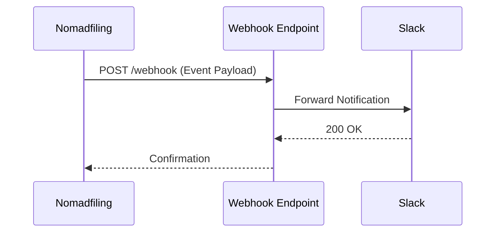

## Overview

Nomadfiling integrates seamlessly with popular tools to streamline your documentation workflows. You can sync changes with GitHub repositories, authenticate users via third-party providers, receive real-time notifications through webhooks, and export content to PDF or static sites. These integrations help you maintain consistency across platforms and automate repetitive tasks.

<Columns cols={2}>
  <Card title="GitHub Sync" icon="github" href="#github-sync">
    Keep your docs in sync with Git repositories for version control and collaboration.
  </Card>
  <Card title="Auth Providers" icon="shield" href="#auth-providers">
    Enable secure logins with Google, GitHub, and more.
  </Card>
  <Card title="Webhooks" icon="zap" href="#webhooks">
    Get instant notifications for doc updates and events.
  </Card>
  <Card title="Exports" icon="download" href="#exports">
    Generate PDFs or static HTML exports effortlessly.
  </Card>
</Columns>

## GitHub and Git Sync

Connect your Nomadfiling workspace to a GitHub repository to automatically sync documentation changes. This enables version control, pull requests, and team collaboration directly from GitHub.

<Steps>
  <Step title="Create Repository" icon="repo">
    Set up a new GitHub repository or use an existing one for your docs.
  </Step>
  <Step title="Connect in Settings" icon="settings">
    Navigate to Workspace Settings > Integrations > GitHub. Authorize Nomadfiling and select your repository.
  </Step>
  <Step title="Sync Changes" icon="git-commit">
    Push updates from Nomadfiling or pull from GitHub. Use the sync button to resolve conflicts.

````bash
git add .
git commit -m "Update documentation"
git push origin main
````

  </Step>
</Steps>

<Callout kind="tip">
  Enable branch protection in GitHub to prevent direct pushes to main.
</Callout>

## Third-party Authentication Providers

Support single sign-on (SSO) with popular providers. Users log in with their existing accounts, improving security and user experience.

<Tabs>
  <Tab title="Google OAuth" icon="google">
    Configure Google OAuth in your provider dashboard.

    <CodeGroup tabs="JavaScript,Python">
    ````javascript
    const { OAuth2Client } = require('google-auth-library');
    const client = new OAuth2Client(CLIENT_ID);
    ````
    ````python
    from google.oauth2 import id_token
    from google.auth.transport import requests
    ````
    </CodeGroup>
  </Tab>
  <Tab title="GitHub OAuth" icon="github">
    Set redirect URI to `https://api.example.com/auth/github/callback`.
  </Tab>
</Tabs>

## Webhooks for Notifications

Webhooks deliver real-time events from Nomadfiling to your services. Subscribe to events like `doc.updated` or `workspace.member_added`.



<ParamField path="webhook_url" param-type="string" required="true">
  Your endpoint URL, e.g., `https://your-webhook-url.com/webhook`.
</ParamField>

<ResponseField name="event" field-type="string">
  Event type like `doc.updated`.
</ResponseField>

<ResponseField name="payload" field-type="object">
  Full event data.
</ResponseField>

Example payload:

```json
{
  "event": "doc.updated",
  "workspace_id": "ws_123",
  "doc_id": "doc_456",
  "timestamp": "2024-01-15T10:30:00Z"
}
```

## Export to PDF or Static Sites

Export your documentation for sharing or archiving. Choose PDF for print-ready files or static sites for hosting.

<Expandable title="Advanced Export Options" default-open="false">
  Customize with CSS themes or include/exclude sections.

  ```bash
  nomadfiling export --format=pdf --theme=dark /path/to/output
  ```
</Expandable>

<Callout kind="info">
  Exports are generated asynchronously. Check the status in your dashboard at `https://dashboard.example.com`.
</Callout>